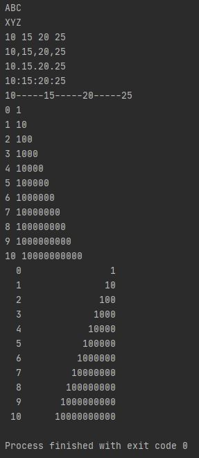
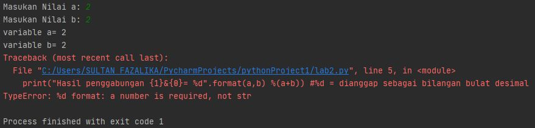

#LATIHAN 6
##Tugas Latihan
- Simpan project Praktikum hari ii ke respository server.
- Buat penjelasan setiap Lab/latihannya pada file README.md

###Lab1
- fungsi `print()` untuk menampilkan data ke perangkat keluaran standar (layar)
- `end` adalah karakter yang dicetak di akhir baris. Defaultnya adalah tanda newline (baris baru).
- `sep` adalah pemisah(separator) yang berfungsi sebagai tanda pemisah antar objek yang dicetak. Defaultnya adalah tanda spasi.
- Fungsi `format()` berfungsi untuk melakukan pengaturan format string yang akan dicetak atau ditampilkan ke monitor.

**Output Lab1** :

###Lab2
- `input()` berfungsi untuk meng-input angka atau huruf kedalam program.
- `%d` membuat bilangan dianggap sebagai bilangan bulat desimal.
- `int()` menyatakan bahwa fungsi tersebut merupakan angka.

**Output Lab2** :

>catatan: ada eror pada kode yang diberikan